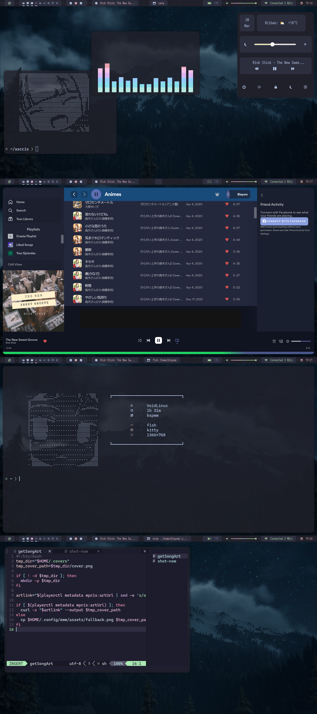

# Bsquarium

This is a configuration for bspwm using the aquarium colorscheme as primary colorscheme.



## Requirements

- xtools (for void)
- feh
- git
- polybar
- sxhkd
- bspwm
- rofi
- picom
- dunst
- neofetch
- kitty
- exa
- bat
- fish-shell (for void, for arch is: fish)
- wget
- unzip
- psmisc (for void)

## Installation

We create an installer, the autodependencies installation only works for void linux and arch linux,
if you have another operative system, see the [requirements](#requirements)

If you have void linux or arch linux, use the installer:

```sh
git clone https://github.com/LinuxReps/bsquarium.git bsquarium
cd bsquarium
bash ./install.sh
```

> The installer is in an experimental phase, use it with your own responsability!

## Uninstallation

Only remove the .config folder :)

## Styles

> In progress!
